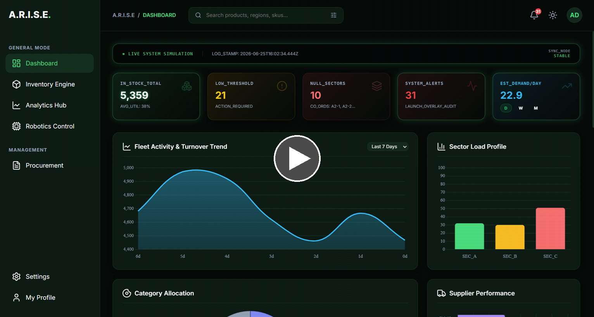
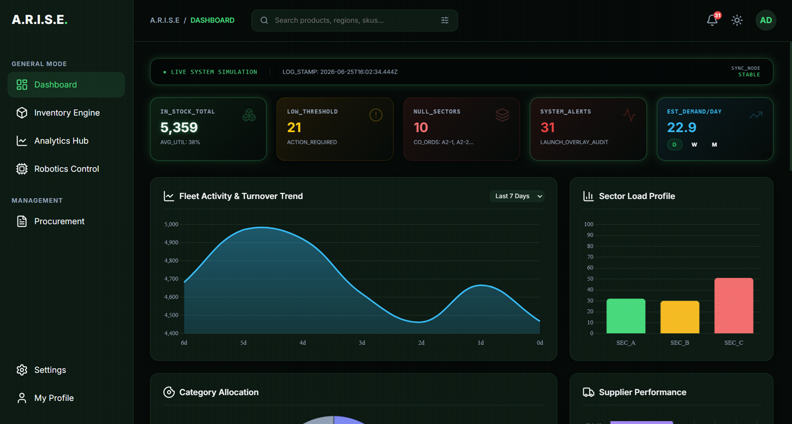
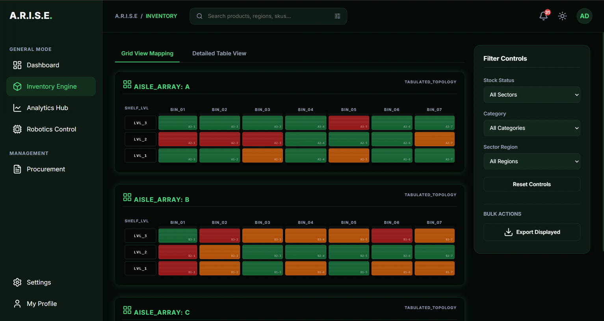
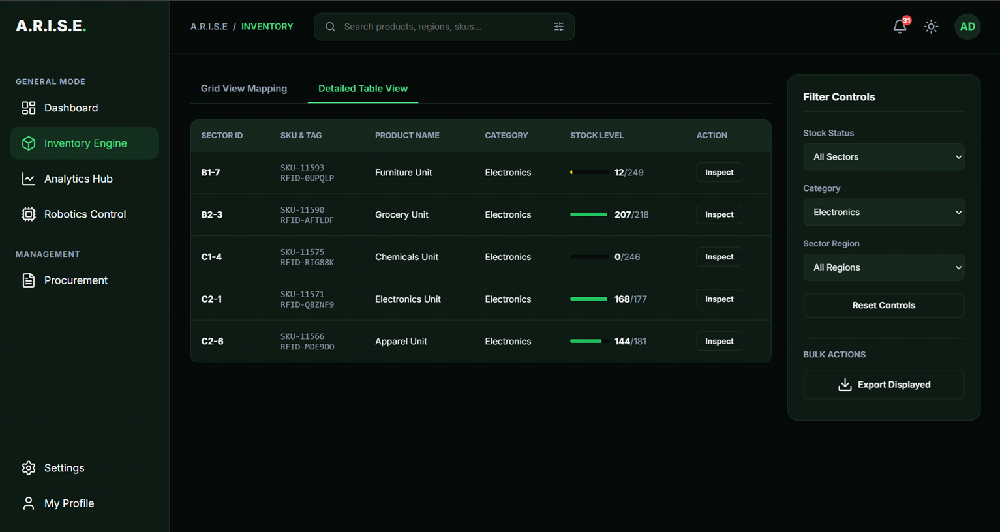
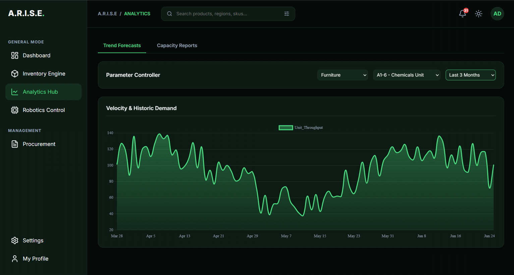
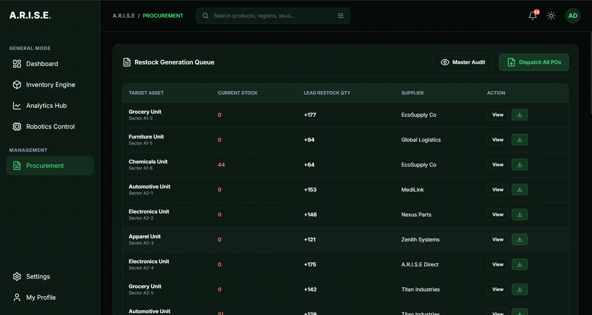
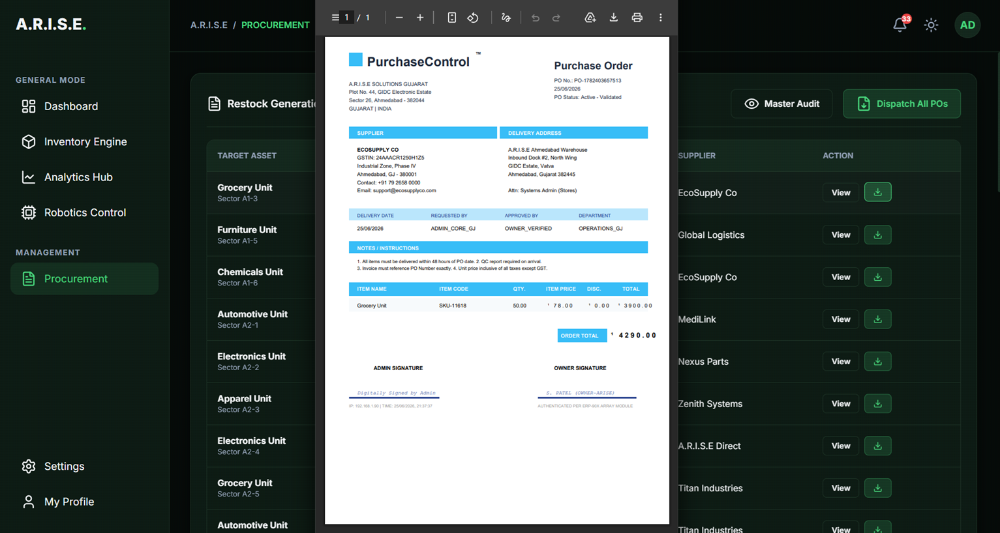
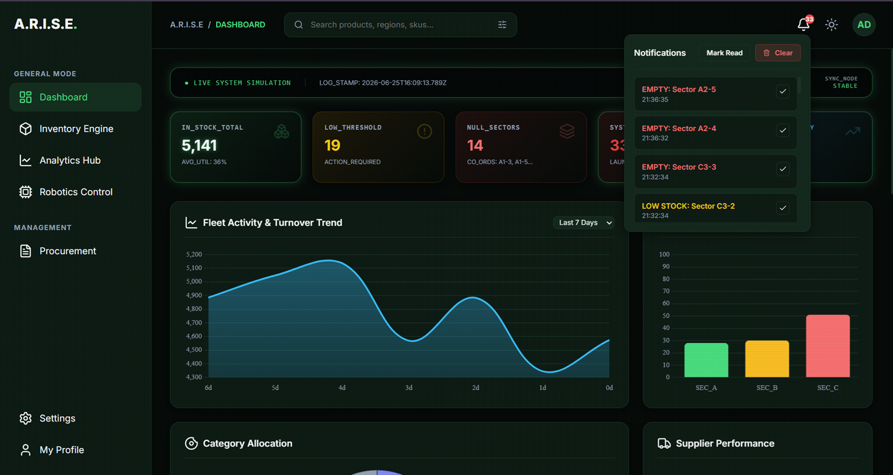

# A.R.I.S.E. — Autonomous Robotics & Intelligent Stock Engine

Welcome to the **A.R.I.S.E.** ecosystem! This project is an advanced, frontend-driven Smart Warehouse ERP and telemetry system designed as the central hub for automated supply chains. It features a modern, responsive single-page dashboard paired with ESP32-based autonomous robot telemetry to synchronize physical inventory data with digital warehouse mappings.

---

## 🚀 Features

### 1. Smart Warehouse ERP Dashboard
* **Real-Time Cellular Grid Mapping**: Dynamic visual box-grid mapping shelf sectors (A, B, C series) and highlighting capacity status (Full, Low, Critical, Empty).
* **Deep Product Inspections**: Interactive sectors revealing detailed product SKU, simulated RFIDs, load margins, and supplier data.
* **Predictive Analytics & Forecasting**:
  * **Demand Prediction Engine**: 7-day smoothing average to forecast sales velocity.
  * **Restock AI Computation**: Lead-time bounds and capacity parameters to compute stock-out risk timelines.
  * **Interactive Charting**: Visualized monthly performance trends, category sales distributions, and shelf utilization rates powered by Chart.js.
* **Automated Procurement**:
  * Generate professional, print-ready purchase orders instantly via jsPDF.
  * Bulk PO generator to automatically group and compute ordering lists for all low-stock SKUs.
* **Dual-Themed Interface**: Sleek Enterprise Dark Mode (Deep Teal/Green) and Light Mode.

### 2. ESP32 Robotics Telemetry Firmware
* **Autonomous Grid Scans**: Simulates or reads physical spatial depth (via Ultrasonic sensor) to update inventory levels dynamically.
* **Gas & Thermal Hazards Alert Node**: Probes ambient atmosphere with an MQ-135 sensor, raising red-alert events to the UI if a hazard is detected.
* **Dual Networking Modes**:
  * **AP Mode (Default)**: Creates a local network (SSID: `ARISE-Robot`, Password: `arise2024`) serving telemetry data at `http://192.168.4.1/telemetry`.
  * **STA Mode**: Joins existing laboratory or office Wi-Fi, reporting telemetry locally.

---

## 🛠️ Hardware Architecture & Wiring

The firmware is designed for an ESP32 Development Module connected to an ultrasonic sensor for inventory mapping, a gas sensor for environmental safety, and an optional motor driver for physical locomotion tracking.

### Pin Configuration
| Component | ESP32 Pin | Description |
|---|---|---|
| **HC-SR04 TRIG** | GPIO 5 | Ultrasonic Trigger Output |
| **HC-SR04 ECHO** | GPIO 18 | Ultrasonic Echo Input |
| **MQ-135 AOUT** | GPIO 34 | Analog Gas Sensor Output |
| **L298N ENA** | GPIO 25 | PWM Motor A Enable |
| **L298N IN1** | GPIO 26 | Motor A Direction 1 |
| **L298N IN2** | GPIO 27 | Motor A Direction 2 |
| **L298N ENB** | GPIO 14 | PWM Motor B Enable |
| **L298N IN3** | GPIO 12 | Motor B Direction 1 |
| **L298N IN4** | GPIO 13 | Motor B Direction 2 |

---

## 🖥️ Project Media & Demos

### Demonstration Video
See the A.R.I.S.E robot and dashboard telemetry in action by clicking the preview image below to play the walkthrough:

[](https://raw.githubusercontent.com/itsyachiguys/A.R.I.S.E/main/assets/arise-fullvideo.mp4)

*(Click the image above to watch the demonstration video)*


### Dashboard Screenshots

Here is a visual walkthrough of the A.R.I.S.E Smart Warehouse ERP Dashboard:

#### 1. Global Overview & Analytics Dashboard


#### 2. Warehouse Map & Cellular Shelf Mapping


#### 3. Real-Time Telemetry & Operations Console


#### 4. Predictive Forecasting & Demand Node


#### 5. Procurement Suite & Purchase Order Generator


#### 6. Detail Modal & Inventory Audits


#### 7. Enterprise ERP Parameter Configurations


---

## 📦 Installation & Setup

### 1. Arduino IDE Setup (for ESP32 Robot)
1. Open Arduino IDE and install the **ESP32 board package** (v2.x or later).
2. Install the **ArduinoJson** library (v6.x) by Benoit Blanchon via the Library Manager.
3. Open `esp32_arise_robot/esp32_arise_robot.ino`.
4. Configure your preferred network mode in the config block:
   ```cpp
   #define NETWORK_MODE "AP" // or "STA"
   ```
5. Connect your ESP32 board, select "ESP32 Dev Module" as the target board, and upload.

### 2. Launching the Web Dashboard
1. Simply double-click `index.html` to open the local dashboard app in any modern web browser.
2. Connect to the ESP32's WiFi access point (`SSID: ARISE-Robot`, `Pass: arise2024`) or ensure your dashboard machine is on the same local network as the ESP32.
3. In the Telemetry panel, enter the IP address of the robot to stream live data.
